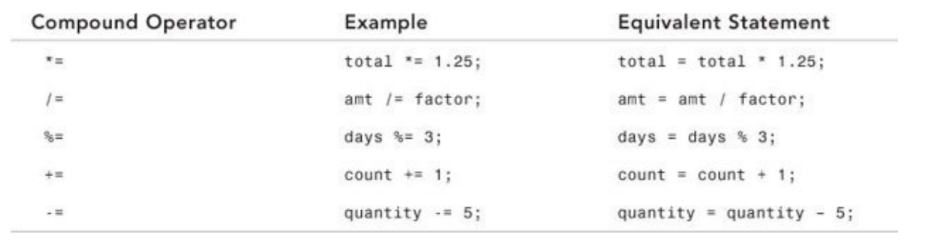
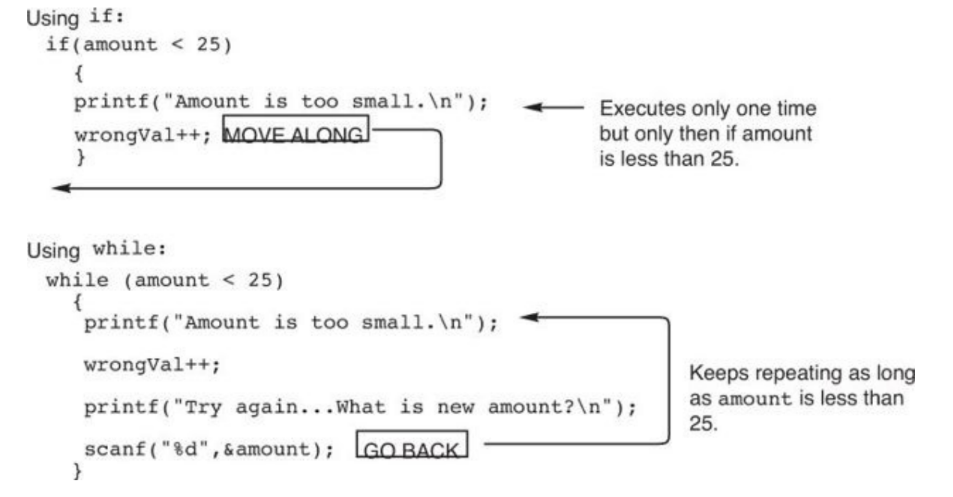

## Udemy Course notes
- to run we do
gcc test.c -o test
./test

- to install we go
https://nuwen.net/mingw.html
then we go to directory under mingG something and then go to bin and take that path and put it in env and then from there we close VS code and retry and it should all work

- doing gcc test.c test1.c test2.c -o runcompiles all of them and if theres error it shows it for each seperate file
- makefiles help compile large files in c

- using a variable from one file to another we do 'extern int moveNumber;' and it wont be restricted on one file on the other hand
- we use static if we are locally using our files
- if no other will have access
    we can do static int moveNumber = 0 which would make it restricted only inside the one file

- creating header files we do the include
header types `stdbool.h`
- Memory Types
    - static, stack, and heap
- Stack
    - Last in First out
    - As the stack grows it is pushed into the stack but once we free them from the stack they are deleted
    - once that stack variable is deleted the region of memory is avilable for other stack variables (pop)
    - if too much information goes into the stack then the stack will overflow (usually when using recursion)
- Heap:
    - Opposite from stack and has a hierarchical structure unline stack where its linear
- use heap when using large memory and when we need a variable that is global
- heap can also change its size as needed
- Use stack when we are doing small variables and is local
### Auto storage class
- create automatic variables in storage
- only exist when needed created when used and killed when finished
### Syntax
- for auto syntax we do: storage_class var_data_type var_name;
    - this indicated that the double variables x and y are automatic local variables and only exist in the body of a function in where its declared
```c
    auto double x, y;
```
[Example Code](./awsExampleCode/autoVar.c)
### External Variables
- can be used in different files 
- tells us its defined somewhere else not in the same block
- this is different since its a global variable that is visible to all program files
- if we want to use the variable that is extern we have to set it as extern
```c
    extern int moveNumber = 0;
    //or
    int moveNumber;
    //w this we can access this int in any file if its initialized at the top of the file
```
- in order to use this we have to define it as a global variable or the compiler will wonder where it is and where its been initialized
[Example Code](./awsExampleCode/externalVar.c)

### Static
- static is the opposite of auto variables
- it can be used in local, global and functions
- when applying to to global variables it will be restricted to only the file that it can created in
- when applying to functions, the function set as static can only be called from within the file its set at
- static are only locally scoped 
[Example Code](./awsExampleCode/staticEx.c)

- statics are only initialized once 
- static variables are initialized at 0 but with automatic variables they dont have a default initial value
- static variables are allocated memory on heap not on stack
### Static vs External
- static means its restricted to only the file or function its initialized in but with extern it can be accessable to any file or method
### Static and Structures
- statics shouldnt be defined inside structures
- its possible to have whole structure as static
- a structure we can define different things in one 'block'
### Register
- Register is a data holding place that is part of the computer processor
- Used to define local variables that are stored in register instead of RAM
    - this makes the use of the variables fast so its better to use if we are using a variable a lot of times and more often
### Advanced Data Types
Define Preprocessor
- Its code that runs before the compiler
- Usually put insude the beginning of the program and ionly used w uppercase and underscores
- We define as a hard coded defintion
- like if we do #define YES 1 it will mean that whenever we write YES it will always have the value of 1 if we write YES anywhere
- this isnt defined as a variable and instead is a special syntax
- Usually is used to make programs more readible and extendable
### Type defs
- Allows creating a name for an existing type
```c Ex: 
    typedef int Counter
    //now Counter can be used instead of int to define a variable
    Counter n, j;
```
[Example Code](./awsExampleCode/typedef.c)
- the reason why typedefs are used is for readability
- in addition, using numbers instead of initializing a vairable is bad and called a magic number
- Using typedefs also create the program more portable
    - For example if we move it to another language where it needs const instead of int initializer then we use the typewdef we globally used to change that one line instead of going everywhere to change our int to const
- We can also user define to initialize our new scope 
Ex:
```c
 #define Counter int; //will have the same result as using typedef in previous statement
```
- When we use #symbol we automatically know that its a preprocessor because of its format and since its a preprocessor the compiler has no interaction with it
- typedef doesnt define a new type only define name
[Example Code](./awsExampleCode/typedef2.c)
- use typedefs when using: array combination, structs, pointers, or functions
- it can also be used for casting since sometimes it has a complicated name
Ex:
```c
    typedef int (*ptr_to_int_fun)(void);
    char * p;
    ....= (ptr_to_int_fun) p;
```
### Variable Length Arrays
- length and size is defined by an expression
- We can work with arrays without a constant size
- its still a fixed size but we can use an expression instead
    - size_t: unsigned int type of at least 16 bits
    - sizeof: returns size of what we are looking for
    - size_type: int datatype large enough to represent any possible string size

[Example Code](./awsExampleCode/variableLengthArrays.c)

[Example Code](./awsExampleCode/variableLengthArrays2.c)

[Example Code](./awsExampleCode/variableLengthArrays3.c)

- Avoid VLA in terms of function parameters, instead use pointers
 
## Book Notes
 - adding '\0' after inserting a string in C shows that the string is done if the string has an array bigger than what defined
 - example
 ```c
        Month[0] = 'M';
        Month[1] = 'a';
        Month[2] = 'r';
        Month[3] = 'c';
        Month[4] = 'h';
        Month[5] = '\0'; //You must add this
```
 - we user %s to print out our string
 - Both do the same thing:
```c
    char month[8] = "January";
    char month[] = "January";
```
- we can use strcpy() to assign a variable to add into an array
- example
```c
    char <variableName>[<size>];
    strcpy(<variableName>, <newVariable>);
```
- `stdio.h` is used when we user printf 
- if we do anything including strings like strcpy we have to include `string.h`
- when using define we can initialize a constact as a whole 
```c
    #define AGELIMIT 21
    #define MYNAME "Paula Holt"
    #define PI 3.14159
        //if we use it somewhere else like here we do
    if(employeeAge < AGELIMIT)
```
- if I do any of the above but I want to create its own file reference I can do that by creating file as a .h to show its a header file 
- % is used to get the remainder of something
### Operations


- Typecasts temporarily change datatype from one variable to another
Example
```c
    int age = 6;
    (float)age;
    //when printed it will show age as a float instead of int
```
- Something to keep in mind is that it doesnt change the data type permanently its only changed temporarily
- When we decrememnt it matters where we put the + and - sign
- For example if we do `count--` then it will decrement in a postfix (increment or decrement, whichever im using) matter after the loop has run once but if we do `--count` then it will decrememnt right before the loop begins

```c
    //this code increments i after multiplying i and j and storing in n
    int i = 2, j = 5, n;
    n = i++ * j; //puts 10 in n and 3 in i postfix - does after
    n = ++i * j; //puts 15 in n since we did it before and now i is 3 prefix - does before
```
- getting the size of something we do `sizeof()`
- when we get the size of a string for example, it will always include a null zero in the size 

```c
    char name[] = "Ruth Claire";
    int i = 7;
    printf("The size of i is %d.\n", sizeof(i)); //returns 4
    printf("The size of name is %d.\n", sizeof(name)); //returns 12 bc of null zero
```

- when using while loops it will loop as long as its true
### Diffference from while and if statements


- When doing do while loops it will always execute once first and then run through the loop after: [Example Code](./bookSourceCode/bookDoWhile.c)

- switch format:
```c
    switch (expression)
    {
    case (expression1): { one or more C statements; }
    case (expression2): { one or more C statements; }
    case (expression3): { one or more C statements; }
    // This would keep going for however many case statements to test
    default: { one or more C statements; }
```
- File example for [SWITCH EXAMPLE](./bookSourceCode/bookSwitch.c)
- STOPPED PAGE 146